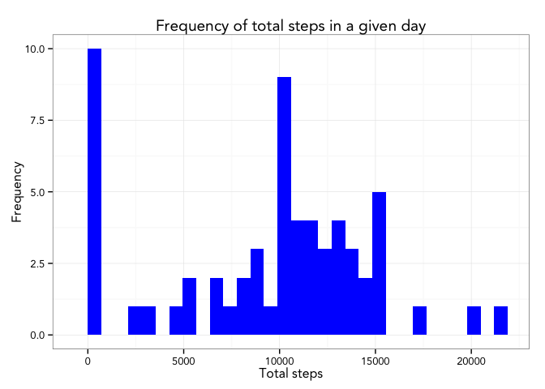
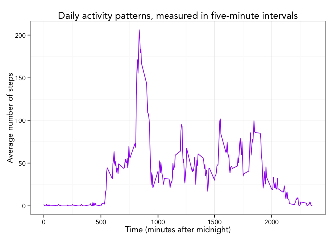
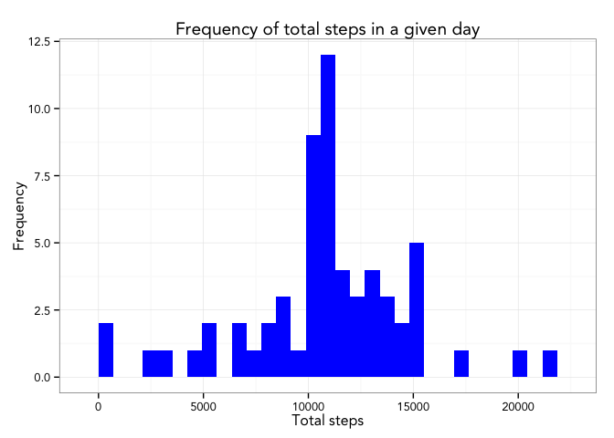
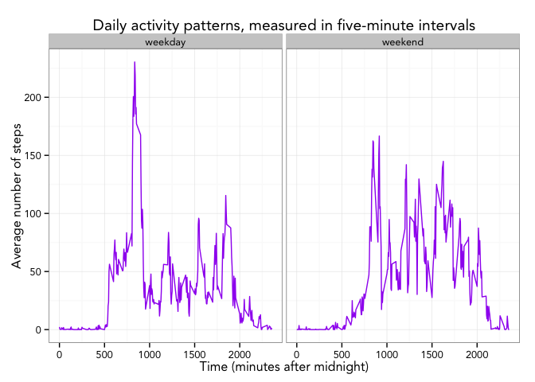

# Reproducible Research: Peer Assessment 1


## Loading and preprocessing the data
Before we get started, we should load all the libraries that we would like to use. We can use the `dplyr` package for simple functions to manipulate data. We can also use the `ggplot2` package to make pretty plots!

```r
library(dplyr)
```

```
## 
## Attaching package: 'dplyr'
## 
## The following object is masked from 'package:stats':
## 
##     filter
## 
## The following objects are masked from 'package:base':
## 
##     intersect, setdiff, setequal, union
```

```r
library(ggplot2)
```

First, we need to make sure that the activity data set exists in the current directory. If it does, we can read it into a data frame, which we then convert into a data table. To avoid confusion, the original data frame is deleted once it has been converted to a data table.

```r
if(file.exists("activity.csv")) {
    activity_data <- read.csv("activity.csv")
    activity_tbl <- tbl_df(activity_data)
    rm("activity_data")
} else {
    stop("Could not find the file 'activity.csv' in the working directory")
}
```

Let's take a look at what is in the activity table:

```r
    activity_tbl
```

```
## Source: local data frame [17,568 x 3]
## 
##    steps       date interval
## 1     NA 2012-10-01        0
## 2     NA 2012-10-01        5
## 3     NA 2012-10-01       10
## 4     NA 2012-10-01       15
## 5     NA 2012-10-01       20
## 6     NA 2012-10-01       25
## 7     NA 2012-10-01       30
## 8     NA 2012-10-01       35
## 9     NA 2012-10-01       40
## 10    NA 2012-10-01       45
## ..   ...        ...      ...
```

There are three columns, indicating the `steps` taken on a given `date` during a given five-minute `interval`. Judging by the looks of the first column, there are some `NA` values in the data set.

## What is mean total number of steps taken per day?
We would like to compute the total number of steps taken each day. The `group_by` function from `dplyr` allows us to group the data set by `date`. Using `summarise`, we can easily report the sum of steps grouped by date. `NA` values are removed in the sum:

```r
    daily_step_tbl <- activity_tbl %>%
        group_by(date) %>%
        summarise(total_steps = sum(steps,na.rm = TRUE))
```

The data table `daily_step_tbl` now contains the total number of steps for each day. We would like to make a histogram of the steps taken each day. The default for `ggplot` histograms is to have thirty bins.

```r
    g <- ggplot(data = daily_step_tbl, aes(total_steps))
    g + geom_histogram(fill = "blue") + 
        theme_bw(base_family = "Avenir", base_size = 12) + 
        ggtitle("Frequency of total steps in a given day") +
        labs(x = "Total steps", y = "Frequency")
```

 

We can also compute the mean and median for the total number of steps taken each day, as well as the minimum and the maximum values and the first and third quartiles, using the `summary` function:

```r
    summary(daily_step_tbl$total_steps)
```

```
##    Min. 1st Qu.  Median    Mean 3rd Qu.    Max. 
##       0    6778   10400    9354   12810   21190
```

The median is 10400 and the mean is 9354. Approximately ten thousand steps per day! That seems pretty active to me.

Now we can remove the data table `daily_step_tbl` because we won't need it any longer:

```r
    rm("daily_step_tbl")
```

## What is the average daily activity pattern?
We would like to see trends in the daily activity pattern from day to day. The `group_by` function from `dplyr` also allows us to group the data set by `interval`. Using `summarise`, we can easily report the average steps grouped by interval. `NA` values are removed in the average. We'd also like to add the time of day for any given interval:

```r
    interval_step_tbl <- activity_tbl %>%
        group_by(interval) %>%
        summarise(average_steps = mean(steps,na.rm = TRUE))
```

The data table `interval_step_tbl` now contains the average number of steps for each time interval throughout the day. We would like to make a time series plot of the steps taken in each interval.

```r
    g <- ggplot(data = interval_step_tbl, aes(interval, average_steps))
    g + geom_line(color="purple") + 
        theme_bw(base_family = "Avenir", base_size = 12) + 
        ggtitle("Daily activity patterns, measured in five-minute intervals") +
        labs(x = "Time (minutes after midnight)", y = "Average number of steps")
```

 

Let's find the 5-minute interval which, on average, contains the maximum number of steps. We can do this using `arrange` to sort our data table in descending order by average number of steps:

```r
    arrange(interval_step_tbl,desc(average_steps))
```

```
## Source: local data frame [288 x 2]
## 
##    interval average_steps
## 1       835      206.1698
## 2       840      195.9245
## 3       850      183.3962
## 4       845      179.5660
## 5       830      177.3019
## 6       820      171.1509
## 7       855      167.0189
## 8       815      157.5283
## 9       825      155.3962
## 10      900      143.4528
## ..      ...           ...
```

It seems like 8:35-8:40am had the greatest number of steps on average... maybe someone is in a hurry to walk to work in the morning?

## Imputing missing values
Let's determine how many `NA` values were in the original data set:

```r
    sum(is.na(activity_tbl$steps))
```

```
## [1] 2304
```

That seems like a lot! Imputation is the process of replacing missing data with substituted values. We will see how imputing data affects our data set. Let's make a new data table, `activity_tbl_2`, where we replace `NA` values with the average for that time interval across all days. The idea being, people are creatures of habit and tend to do the same thing every day. We replicate the average for each time interval 61 times, as there were 61 days worth of measurements, and then use `cbind` to add the average steps for each time interval to the data table. Then we perform the imputing step by using `mutate`:


```r
    average_steps <- rep(interval_step_tbl$average_steps,61)
    activity_tbl_2 <- tbl_df(cbind(activity_tbl,average_steps)) %>%
        mutate(steps = ifelse(is.na(steps),average_steps,steps))
```

Let's make a histogram of the data set after imputing, the same way we did before:

```r
    daily_step_tbl <- activity_tbl_2 %>%
        group_by(date) %>%
        summarise(total_steps = sum(steps,na.rm = TRUE))
    g <- ggplot(data = daily_step_tbl, aes(total_steps))
    g + geom_histogram(fill = "blue") + 
        theme_bw(base_family = "Avenir", base_size = 12) + 
        ggtitle("Frequency of total steps in a given day") +
        labs(x = "Total steps", y = "Frequency")
```

 

There are now much fewer outliers on the left-hand side of our histogram. We can summarize this data set:

```r
    summary(daily_step_tbl$total_steps)
```

```
##    Min. 1st Qu.  Median    Mean 3rd Qu.    Max. 
##      41    9819   10770   10770   12810   21190
```

The median is not changed by much, but the mean is over a thousand steps larger! Perhaps all the missing values  were skewing the data set too low, or perhaps imputing missing data is skewing our perceived steps per day a bit higher.

## Are there differences in activity patterns between weekdays and weekends?
We would like to see trends in the daily activity pattern from day to day for weekdays versus weekends, using the imputed data set `activity_tbl_2` from the previous step. The `group_by` function from `dplyr` also allows us to group the data set by two variables, `interval` and a factor variable `isweekend` that tells us whether a day is a weekday or a weekend. Using `summarise`, we can easily report the average steps grouped by `interval` and `isweekend`. We'd also like to add the time of day for any given interval:

```r
    weekends_array <- c('Saturday', 'Sunday')

    weekday_step_tbl <- activity_tbl_2 %>%
        mutate(date = as.Date(date),
               Day = factor((weekdays(date) %in% weekends_array),
                                  levels=c(FALSE, TRUE),
                                  labels=c('weekday', 'weekend') )) %>%
        group_by(Day,interval) %>%
        summarise(average_steps = mean(steps,na.rm = TRUE))
```

Using `facet_grid`, we can make a two-panel plot comparing weekday versus weekend activity.


```r
    g <- ggplot(data = weekday_step_tbl, aes(interval, average_steps))
    g + geom_line(color="purple") + 
        facet_grid(. ~ Day) +
        theme_bw(base_family = "Avenir", base_size = 12) + 
        ggtitle("Daily activity patterns, measured in five-minute intervals") +
        labs(x = "Time (minutes after midnight)", y = "Average number of steps")
```

 

The most notable difference is much higher activity earlier in weekdays than in weekends. Looks like somebody likes to sleep in a little on the weekends :)
